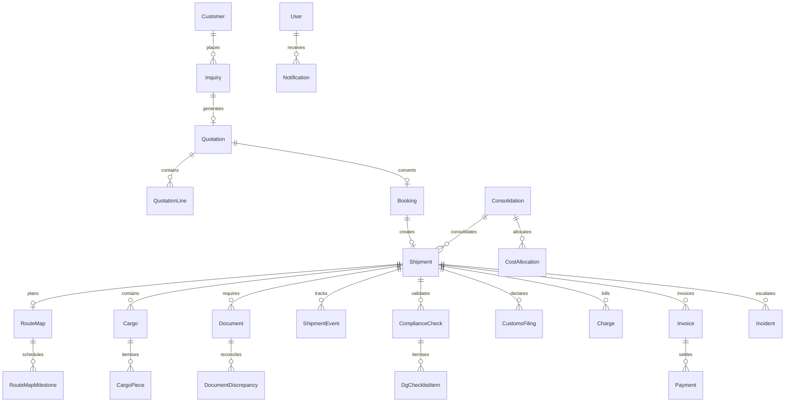

# ASTRA Domain Model (overview)

> **Companion to [`spec.md`](./spec.md) §5**, which is authoritative for fields, statuses and rules.
> This file gives the shape of the model; `spec.md` gives the contract.

ASTRA models freight-forwarding from inquiry through financial closure. The MVP emphasizes **air freight** while keeping `transportMode`, `direction`, and carrier types extensible for sea, road, rail, courier, import, and export.

## Base persistence fields

Most operational entities include:

| Field | Purpose |
|-------|---------|
| `id` | Stable UUID |
| `createdAt` / `updatedAt` | ISO 8601 UTC |
| `createdBy` / `updatedBy` | User id |
| `version` | Optimistic concurrency |
| `syncStatus` | `local` \| `pending` \| `syncing` \| `synced` \| `failed` \| `conflict` |
| `deletedAt` | Soft delete when applicable |

## Sync status semantics

- **local** — Created offline, not yet queued for remote sync
- **pending** — Mutation recorded in outbox
- **syncing** — Transport in flight (future backend)
- **synced** — Matches remote revision
- **failed** — Retryable transport error
- **conflict** — Requires operator resolution

## Core aggregates (planned)

## Aggregates added after market research

These are not in the original brief. Each exists because the flow it supports is otherwise unimplementable — see [`market-research.md`](./market-research.md) for the evidence.

| Aggregate | Why | Decision |
|-----------|-----|----------|
| **RouteMap / RouteMapMilestone** | Delay must be variance against a plan created at booking (Cargo iQ model), not a hand-typed field | `D-04`–`D-07` |
| **Consolidation / CostAllocation** | MAWB/HAWB consolidation is the normal case in air forwarding; buy cost must allocate to houses auditably | `D-10`–`D-12` |
| **CustomsFiling** | ICS2/AMS filings have their own lifecycle and legally gate departure | `D-13`–`D-15` |
| **CargoPiece** | Piece-level tracking, and ONE Record models pieces as first-class objects | `D-02` |
| **DocumentDiscrepancy** | Cross-document reconciliation is the honest, offline form of "AI document checking" | `D-22` |
| **DgChecklistItem** | DG acceptance is an itemised IATA checklist, not a single boolean | `D-17` |
| **RateCard / RateLine** | Instant quoting from stored rates; quote turnaround is a measured KPI | `D-21` |
| **LaneRule / RouteMapTemplate / ExceptionRoutingRule** | Requirements, plans and routing are data, not code branches | `D-15`, `D-05`, `D-20` |

`Charge` also gains `costBasis` (estimated/accrued/actual) and `isDisbursement`, because forwarder P&L is job costing with accruals and disbursements must stay out of gross profit (`D-23`–`D-25`).

## Transport and direction

- **Transport modes:** `air`, `sea`, `road`, `rail`, `courier`
- **Directions:** `import`, `export`, `domestic`

Shipments carry mode-specific optional fields (e.g. `mawb` / `hawb` for air, vessel fields for sea) without separate product silos.

## Shipment lifecycle

Statuses are **not** assigned from UI directly. A central state machine will validate transitions, append **ShipmentEvent** records (append-only), write **AuditLog** entries, enqueue sync operations, and raise **Incident** records on failure paths.

Terminal states include `financially_closed`, `closed`, and `cancelled`. Financially closed shipments must not be silently mutated.

## Financial model

- **Quotation** lines: buy/sell rates, tax, margin
- **Charge** entities on shipments (buy, sell, or both)
- **Invoice** (customer, vendor, credit note) with balance tracking
- **Payment** application with receivable/payable/refund types

Monetary calculations use decimal-safe arithmetic (minor units or a tested decimal helper).

## Documents and compliance

- **Document** metadata + optional `localBlob` in IndexedDB
- OCR is **simulated** in MVP; results are deterministic and labelled
- **ComplianceCheck** records rule outcomes; sanctions screening uses a simulated adapter only

## Users and roles

Roles: Administrator, Sales, Pricing, Operations, Documentation, Compliance, Warehouse, Finance, Manager, Customer (portal). Demo auth will map seeded users to roles for permission guards.

## Extensibility rules

1. New transport modes extend enums and optional shipment fields, not duplicate workflows.
2. Historical quotation revisions are immutable; revisions create new records.
3. Events and audit entries are append-only.
4. All outbound mutations are idempotent via client-generated operation ids (sync outbox).
