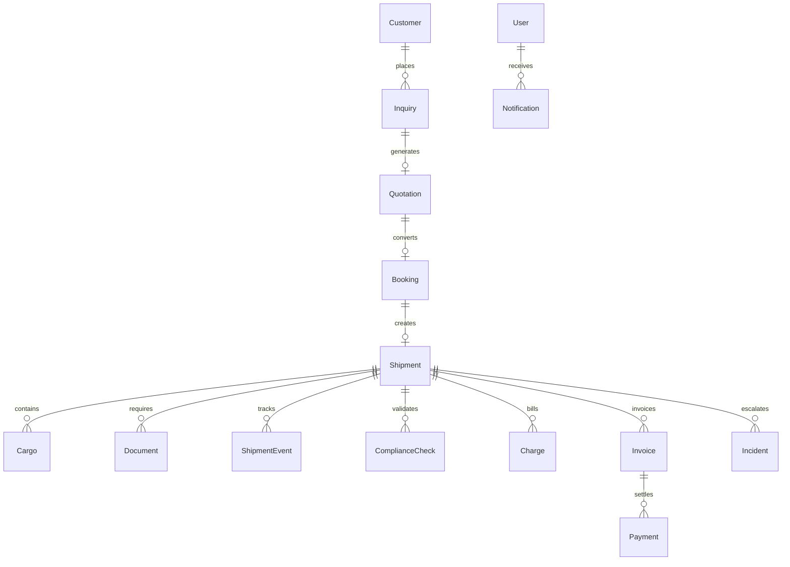

# ASTRA Domain Model (overview)

ASTRA models freight-forwarding from inquiry through financial closure. The MVP emphasizes **air freight** while keeping `transportMode`, `direction`, and carrier types extensible for sea, road, rail, courier, import, and export.

## Base persistence fields

Most operational entities include:

| Field | Purpose |
|-------|---------|
| `id` | Stable UUID |
| `createdAt` / `updatedAt` | ISO 8601 UTC |
| `createdBy` / `updatedBy` | User id |
| `version` | Optimistic concurrency |
| `syncStatus` | `local` \| `pending` \| `syncing` \| `synced` \| `failed` \| `conflict` |
| `deletedAt` | Soft delete when applicable |

## Sync status semantics

- **local** — Created offline, not yet queued for remote sync
- **pending** — Mutation recorded in outbox
- **syncing** — Transport in flight (future backend)
- **synced** — Matches remote revision
- **failed** — Retryable transport error
- **conflict** — Requires operator resolution

## Core aggregates (planned)

## Transport and direction

- **Transport modes:** `air`, `sea`, `road`, `rail`, `courier`
- **Directions:** `import`, `export`, `domestic`

Shipments carry mode-specific optional fields (e.g. `mawb` / `hawb` for air, vessel fields for sea) without separate product silos.

## Shipment lifecycle

Statuses are **not** assigned from UI directly. A central state machine will validate transitions, append **ShipmentEvent** records (append-only), write **AuditLog** entries, enqueue sync operations, and raise **Incident** records on failure paths.

Terminal states include `financially_closed`, `closed`, and `cancelled`. Financially closed shipments must not be silently mutated.

## Financial model

- **Quotation** lines: buy/sell rates, tax, margin
- **Charge** entities on shipments (buy, sell, or both)
- **Invoice** (customer, vendor, credit note) with balance tracking
- **Payment** application with receivable/payable/refund types

Monetary calculations use decimal-safe arithmetic (minor units or a tested decimal helper).

## Documents and compliance

- **Document** metadata + optional `localBlob` in IndexedDB
- OCR is **simulated** in MVP; results are deterministic and labelled
- **ComplianceCheck** records rule outcomes; sanctions screening uses a simulated adapter only

## Users and roles

Roles: Administrator, Sales, Pricing, Operations, Documentation, Compliance, Warehouse, Finance, Manager, Customer (portal). Demo auth will map seeded users to roles for permission guards.

## Extensibility rules

1. New transport modes extend enums and optional shipment fields, not duplicate workflows.
2. Historical quotation revisions are immutable; revisions create new records.
3. Events and audit entries are append-only.
4. All outbound mutations are idempotent via client-generated operation ids (sync outbox).
