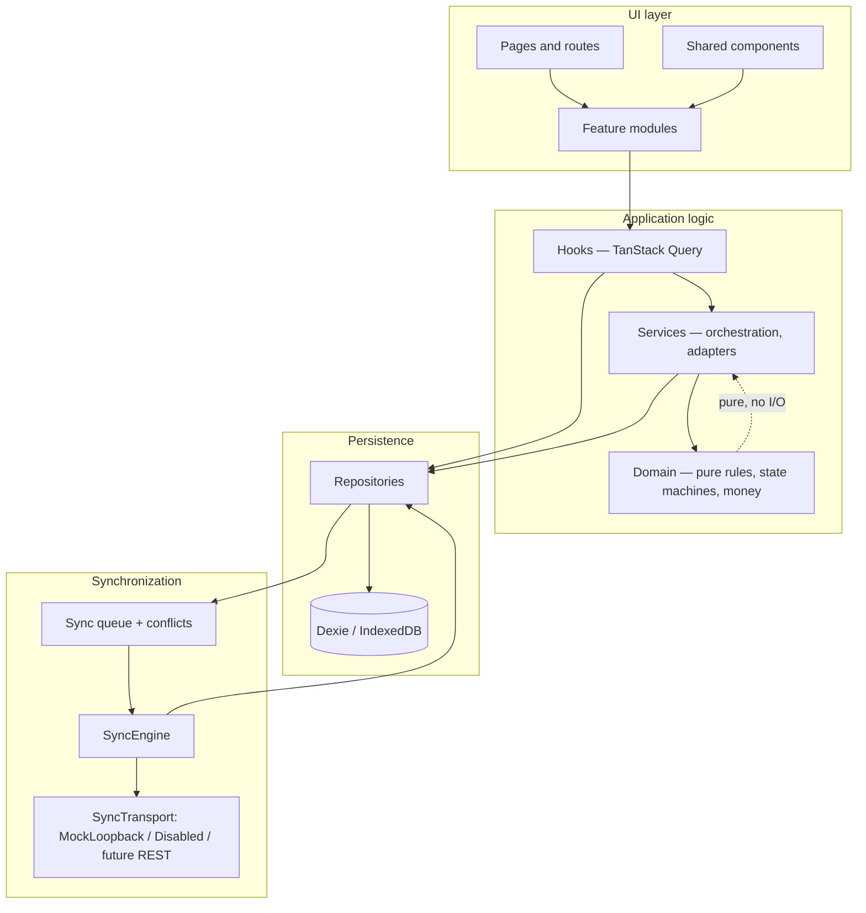

# ASTRA Implementation Plan

Required by the product brief (§17). This is the **phase-level** plan and the architecture overview.
Task-level detail — IDs, dependencies, exit criteria, parallel lanes — is in [`plan.md`](./plan.md).
Current status is in [`handoff.md`](./handoff.md).

---

## High-level architecture



The single rule that holds this together: **arrows never skip a layer.** UI does not reach the database; domain does not reach anything.

---

## Phase 0 — Scaffold (complete, commit `4577e05`)

Delivered a runnable offline-first PWA shell:

- Vite + React 19 + TypeScript (strict)
- Tailwind CSS and accessible layout primitives
- React Router application shell
- Dexie / IndexedDB with base entity metadata and sync outbox
- `vite-plugin-pwa` for an installable, cache-first app shell
- Vitest + Testing Library + `fake-indexeddb`
- Architecture docs

**Verified:** `npm ci`, `npm run typecheck`, `npm test` (2 tests), `npm run build` all pass; app loads with no network; local DB initializes.

---

## Phase 1 — Platform foundation → `P1-01 … P1-10`

Dexie schema v2 with every entity · decimal-safe money domain · transactional base repository (validate → version → audit → outbox) · audit log and viewer · demo authentication with capability guards · reference seed data and Reset Demo Data · app shell with the required navigation, Workboard, and loading/empty/error states · notification centre · error boundary and typed domain errors · coverage thresholds and CI.

**Exit:** every role logs in and lands on a working shell; every write audits and queues; all eight npm scripts pass.

---

## Phase 2 — Commercial workflow → `P2-01 … P2-06`

Customers and contacts · inquiries · rate cards and instant rating · quotation builder with live margin · quotation state machine with revisions and pricing approval · booking conversion with a commercial snapshot and credit-limit guard.

**Exit:** inquiry → quotation → approval → booking completes offline; expired quotations refuse acceptance; revisions are immutable.

---

## Phase 3 — Shipment operations → `P3-01 … P3-09`

Shipment creation from booking · cargo and piece-level detail · route-map planning · the shipment state machine with its guard set · append-only event timeline using FSU codes · the tabbed shipment workspace with a next-action panel · milestone monitoring · tracking screen · internal notes.

**Exit:** illegal transitions are refused with actionable codes; a missed milestone surfaces within a minute, offline.

---

## Phase 4 — Documents and compliance → `P4-01 … P4-06`

Document storage with Blobs and checksums · simulated OCR with confidence and retry limits · side-by-side review · cross-document reconciliation · the compliance rule engine with holds and overrides · DG acceptance checklist and the simulated screening adapter.

**Exit:** a shipment cannot be tendered with a missing document, an unresolved discrepancy, or an incomplete DG checklist.

---

## Phase 5 — Carrier, consolidation and customs → `P5-01 … P5-05`

Ranked carrier options with an explainable score · carrier booking with a recorded rationale · consolidation build · auditable cost allocation · customs filings that hard-block departure.

**Exit:** departure is refused while a required filing is outstanding; consol costs allocate exactly.

---

## Phase 6 — Physical operations → `P6-01 … P6-04`

Photo and signature capture · pickup · warehouse receipt with screening and damage reporting · delivery and POD.

**Exit:** a driver completes pickup and delivery entirely offline, including media, with nothing lost across a restart.

---

## Phase 7 — Finance → `P7-01 … P7-06`

Charges with estimated/accrued/actual basis and disbursement flags · the financial calculation service · customer invoicing with duplicate refusal and credit notes · payments and receivables · vendor invoice matching · job P&L and closure freeze.

**Exit:** a job reaches `financially_closed` and then refuses mutation; disbursements never inflate gross profit.

---

## Phase 8 — Exceptions, dashboards and reports → `P8-01 … P8-05`

Incident engine with routing and deduplication · escalation timers · deterministic delay prediction · dashboard KPIs and charts from local data · the fifteen required reports with CSV export.

**Exit:** exceptions route, escalate and close with a root cause; no chart reads from a literal.

---

## Phase 9 — Sync, portal and quality → `P9-01 … P9-06`

Sync engine hardening with the five required interfaces · conflict resolution UI · Sync Centre and development simulator · customer portal with enforced scoping · accessibility and performance pass · the full demo dataset and documentation.

**Exit:** all 30 acceptance criteria in [`spec.md`](./spec.md) §20 hold; final verification per [`plan.md`](./plan.md) §14 is recorded.

---

## Cross-cutting

| Concern | Approach |
|---------|----------|
| Domain logic | `src/domain` (pure) + `src/services` (orchestration) |
| Persistence | `src/db` + `src/repositories` — the only IndexedDB callers |
| UI | `src/features/*` with thin pages |
| Sync | `src/sync` transport adapters behind interfaces |
| AI / OCR / screening / rates | Deterministic simulators, explicitly labelled ([`spec.md`](./spec.md) §12) |
| Security | [`security-notes.md`](./security-notes.md) |
| Backend readiness | [`future-backend.md`](./future-backend.md) |

## Repository layout

```
src/
  app/           providers, router, bootstrap
  components/    shared UI
  db/            Dexie schema, migrations, seed
  domain/        pure rules and state machines
  features/      feature modules
  hooks/
  layouts/
  pages/
  repositories/
  services/
  sync/
  test/
  types/
  utils/
```
