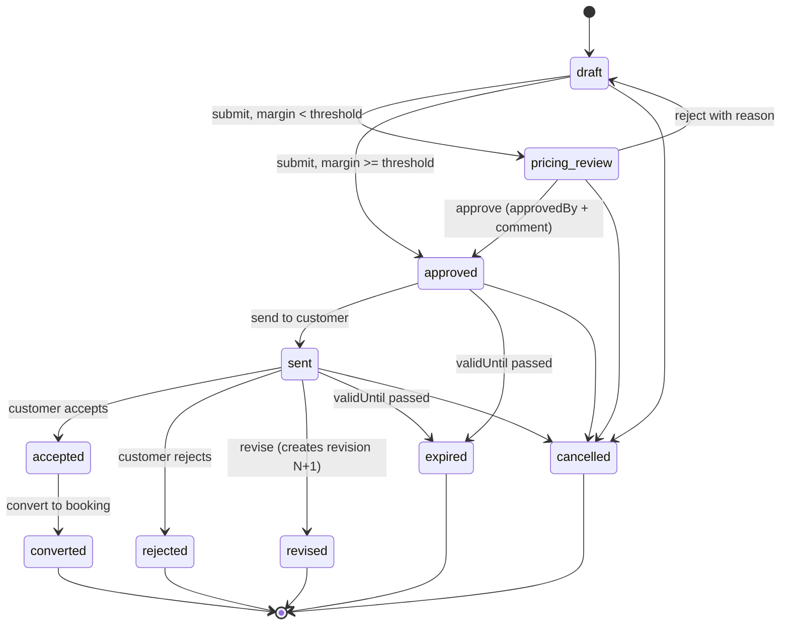
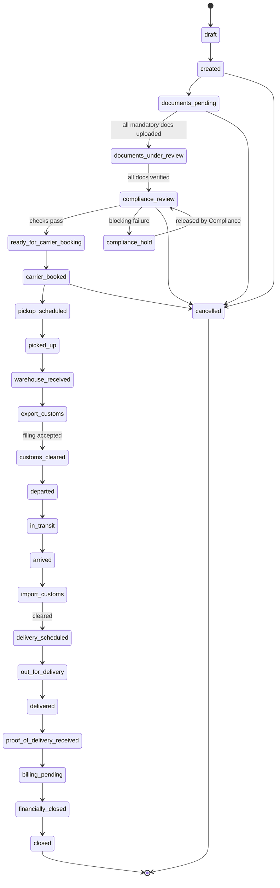
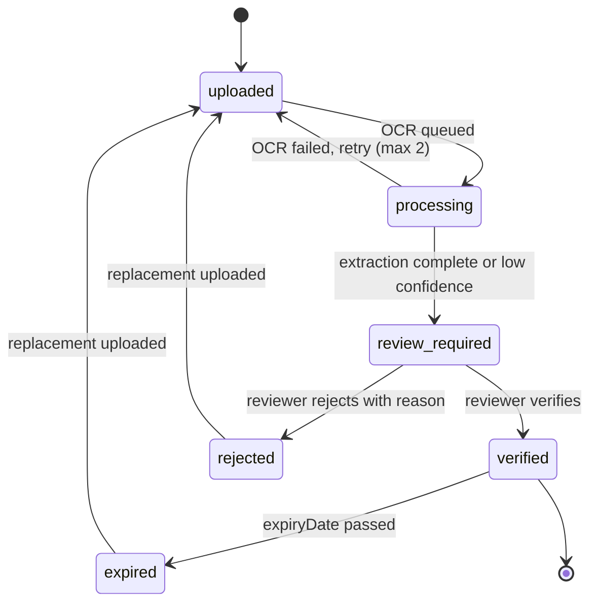
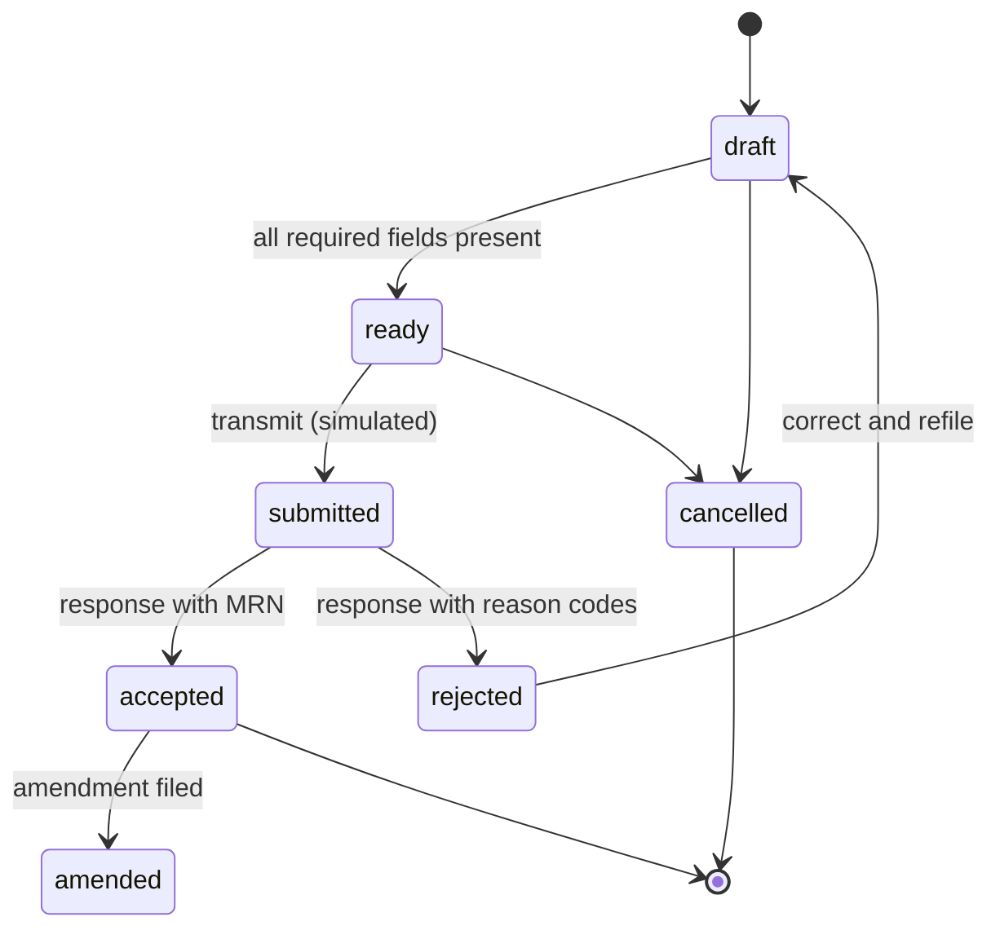
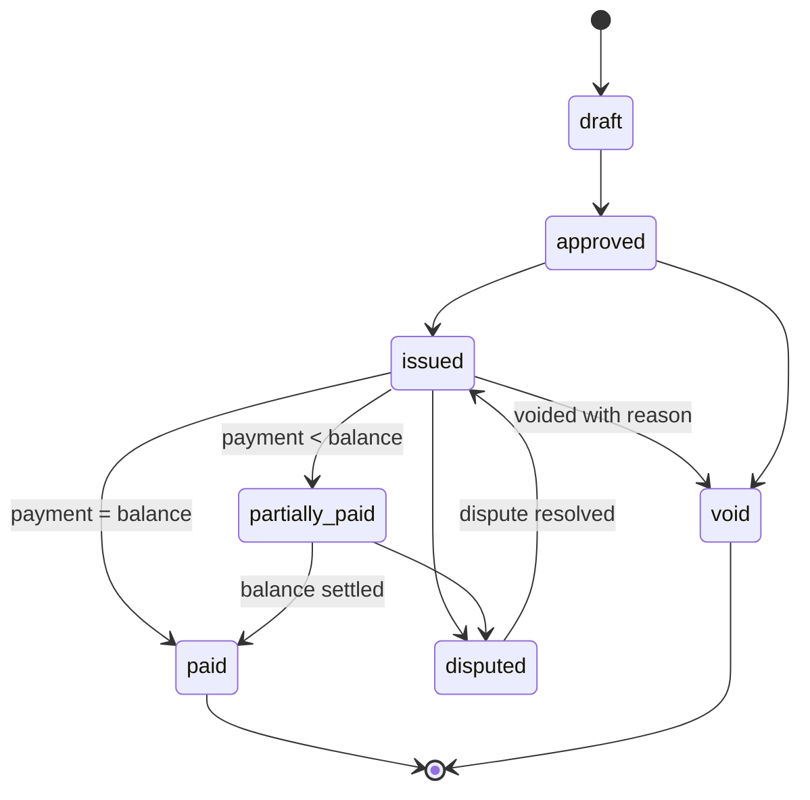
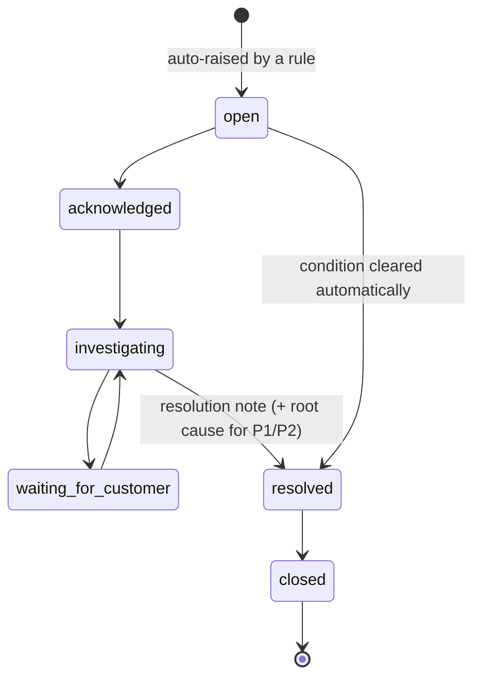
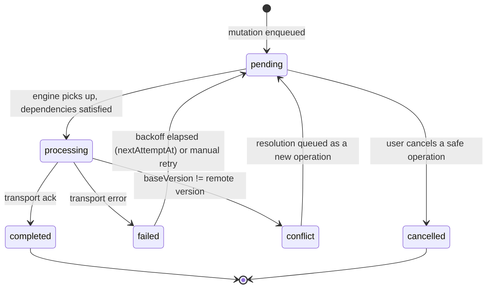

# ASTRA — State Machines

Every status in ASTRA is owned by a state machine in `src/domain/`. **Pages never assign a status.** Transitions are declared as data, validated centrally, and executed through a service that writes history.

Field definitions live in [`spec.md`](./spec.md) §5. Flow context lives in [`user-flows.md`](./user-flows.md).

---

## 1. The transition contract

```ts
interface TransitionRule<S, C> {
  from: S
  to: S
  capability: Capability
  guards: Array<(ctx: C) => GuardResult>   // pure predicates
  effects: TransitionEffect[]
}

type GuardResult = { ok: true } | { ok: false; code: ErrorCode; message: string }
```

`transitionShipment()` (and its siblings) run inside **one Dexie transaction**:

1. Find the rule — unknown transition → `E_TRANSITION_NOT_ALLOWED`
2. Check capability → `E_FORBIDDEN`
3. Run **all** guards and collect **every** failure — never stop at the first, the operator needs the full picture
4. Apply the status change and bump `version`
5. Append the history record (`ShipmentEvent` / revision)
6. Write the `AuditLog` entry
7. Enqueue the `SyncOutboxEntry`
8. Update the route-map milestone and recompute variance
9. Emit notifications
10. Raise an `Incident` where the rule declares one

Either all ten happen or none do.

---

## 2. Quotation



**Guards**

| Transition | Guard | Code |
|-----------|-------|------|
| `→ approved` | margin ≥ threshold, or an approval exists | `E_MARGIN_APPROVAL_REQUIRED` |
| `sent → accepted` | `now <= validUntil` | `E_QUOTATION_EXPIRED` |
| `accepted → converted` | customer not `credit_hold`; exposure + value ≤ credit limit unless overridden | `E_CREDIT_LIMIT_EXCEEDED` |
| any edit of a `revised` record | refused | `E_TRANSITION_NOT_ALLOWED` |

**Revision rule.** Revising a `sent` quotation writes a **new record** with `revision = N+1` sharing `quotationGroupId`. Revision N moves to `revised` and becomes immutable. Historical revisions are never overwritten.

---

## 3. Shipment



`compliance_hold` is reachable from **any** pre-`departed` status and exits only via compliance release. `cancelled` is reachable from any pre-`departed` status with `shipment:cancel` and a reason.

**Blocking guards** (the full table is `spec.md` §5.12):

| Target | Guard | Code |
|--------|-------|------|
| `compliance_review` | all mandatory documents verified | `E_DOCS_INCOMPLETE` |
| `ready_for_carrier_booking` | no failed check; DG checklist complete | `E_COMPLIANCE_BLOCKED` |
| `ready_for_carrier_booking` | no unresolved `error` discrepancies | `E_DISCREPANCY_OPEN` |
| `carrier_booked` | carrier + flight + (MAWB or consol) | `E_CARRIER_INCOMPLETE` |
| `warehouse_received` | received pieces recorded | `E_RECEIPT_INCOMPLETE` |
| **`departed`** | **every required customs filing `accepted`** | `E_CUSTOMS_NOT_ACCEPTED` |
| **`departed`** | screening satisfied or known consignor valid | `E_SECURITY_NOT_SATISFIED` |
| `billing_pending` | POD document present | `E_POD_MISSING` |
| `financially_closed` | invoice issued, charges approved, POD exists, no blocking incident | `E_BILLING_INCOMPLETE` |
| any forward move | not on hold, not cancelled, not closed | `E_SHIPMENT_FROZEN` |

**Frozen after closure.** `financially_closed` and `closed` refuse all mutation with `E_JOB_CLOSED`. Reopening is an explicit, audited action for Finance or Administrator only.

---

## 4. Document



OCR sub-state: `not_started → queued → processing → completed | low_confidence | failed`. **At most two retries**; still below threshold → P3 incident and the document stays in `review_required`.

---

## 5. Customs filing



A required filing that is not `accepted` blocks the shipment's `departed` transition. **A queued transmission is not a lodged filing** and the UI must say so — these carry legal deadlines.

---

## 6. Invoice



`overdue` is **derived**, never stored: `balanceAmount > 0 && now > dueDate`. Issued invoices cannot be deleted — corrections are credit notes referencing the original. Payments beyond the remaining balance are refused with `E_OVERPAYMENT`.

---

## 7. Incident



Escalation timers by priority: P1 every 15 min · P2 hourly · P3 every 4 h · P4 daily. In-app escalation is real; external channels are simulated.

**Deduplication:** while an incident is open, `(shipmentId, errorCode, subjectId)` may not produce a second one — the existing incident gains an occurrence instead.

---

## 8. Sync operation



Replay of a `completed` `operationId` is a no-op. Operations listing `dependencyOperationIds` wait for those to complete; a failed dependency holds its dependants rather than applying them out of order. Financial and compliance conflicts never auto-resolve.

---

## 9. Testing requirement

Every machine in this document needs:

1. A test that **every declared transition** succeeds when its guards pass.
2. A test that **every guard** refuses with its documented error code when it fails.
3. A test that an **undeclared transition** is refused.
4. A test that a transition writes its event, audit entry and outbox entry — and that a forced mid-transaction failure leaves **no partial state**.

Target: 100% branch coverage on `src/domain/**` state machines.
