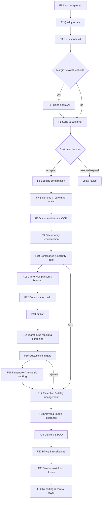

# ASTRA User Flows

**Status:** authoritative flow definition. Implementations must match the flow IDs here; `plan.md` schedules them and `spec.md` defines the data and rules behind them.

These flows were rewritten against how forwarding desks actually work in 2026 — see [`market-research.md`](./market-research.md) for the evidence and decision IDs (`D-xx`) referenced throughout.

---

## 0. Flow design principles

1. **Exception-first.** No role's home screen is a list of everything. Each role lands on a Workboard of items that need a human, ordered by consequence. (`D-19`)
2. **Gates are domain guards, not disabled buttons.** Departure blocked by an unaccepted customs filing is enforced in the state machine; the UI merely explains it. (`D-14`)
3. **Plan then measure.** Every shipment gets a route map at booking; "late" means variance against that plan, not a gut feel. (`D-04`…`D-07`)
4. **Offline is a first-class path, not a degraded one.** Every flow below declares its offline behaviour. Field flows (pickup, warehouse receipt, POD) must complete fully offline.
5. **Every simulated surface says so.** OCR, screening, rate options, CO₂, delay prediction and non-in-app notifications carry a visible badge and a `simulated: true` flag in their result. (`D-18`)
6. **One reason per screen.** A screen exists to let someone finish a decision, not to display an entity.
7. **Nothing is deleted.** Corrections append. Revisions supersede. Closure freezes. (`D-26`)

---

## 1. End-to-end lifecycle



Customer-facing visibility (`F23`) runs alongside from `F7` onward. Sync and conflict resolution (`F24`) runs under everything.

---

## 2. Role workboards (`D-19`)

Every authenticated user lands on the **Dashboard**, whose default surface is the Workboard; the KPI cards and charts required by the brief (§8.2) sit alongside it on the same route. The Workboard is one component fed by a shared `WorkItem` projection, filtered by role. Three bands, always in this order:

| Band | Meaning | Sort |
|------|---------|------|
| **Needs you now** | Blocking a gate, SLA breached, or P1/P2 incident | Consequence, then age |
| **Needs you today** | Due within the shift, at-risk milestones, approvals waiting | Due time |
| **Watching** | Assigned but not actionable yet | Next milestone time |

Each card states: what it is, why it is here, what happens if ignored, and the single primary action.

| Role | Needs you now | Needs you today | Watching |
|------|---------------|-----------------|----------|
| **Sales Executive** | Quotes expiring < 24h; rejected quotes unactioned | New inquiries unassigned; quotes awaiting customer > 3 days | Won bookings in progress |
| **Pricing Executive** | Margin-approval requests; below-threshold quotes | Rate cards expiring < 7 days | Lane margin drift |
| **Operations Executive** | Departure blocked; missed milestone; carrier booking overdue | Pickups due today; consols to close | Shipments in transit on plan |
| **Documentation Executive** | Missing mandatory doc blocking a gate; rejected doc | Low-confidence OCR review queue; discrepancies open | Docs expiring < 14 days |
| **Compliance Officer** | Failed checks; DG checklist incomplete; simulated sanctions match | Security status expiring; overrides awaiting review | Holds released today |
| **Warehouse Executive** | Cargo on hand not receipted > 2h; damage reports open | Expected arrivals today; screening due | Cargo awaiting tender |
| **Finance Executive** | Invoices overdue > 30 days; disputed invoices | Shipments delivered but unbilled; vendor invoices to match | Jobs approaching closure |
| **Manager** | P1/P2 incidents; SLA breaches; approvals > 4h old | Escalations due; margin exceptions | Lane performance trend |
| **Administrator** | Sync conflicts; failed outbox operations | User/role requests; seeded-data drift | System health |
| **Customer (portal)** | Action required from you (missing doc, invoice due) | Shipments arriving today | All active shipments |

**Acceptance:** the Workboard must render its first band in under 200 ms from IndexedDB with no network, and must never show an item the role cannot act on.

---

## 3. Flow catalogue

Each flow is written as: **trigger → actor → preconditions → steps → resulting state → offline → exceptions → done when**.

---

### F1 — Inquiry capture

**Trigger** Customer email/call, or portal submission. **Actor** Sales Executive.

**Preconditions** None. A customer record is *not* required — an inquiry can create a lead.

**Steps**
1. Sales opens **New inquiry**. Single screen, no wizard.
2. Customer field is a combobox: pick existing, or type a new name → creates `Customer` with `status: 'lead'` inline. No context switch.
3. Enter mode (air preselected), direction, origin/destination (airport/port code lookup, seeded IATA/UN-LOCODE data, works offline), cargo summary (pieces, gross weight, dimensions, commodity), requested pickup/delivery dates, incoterm, special instructions.
4. System computes volumetric and chargeable weight live as dimensions are typed, showing the formula used.
5. Save → `inquiryNumber` allocated from this device's reserved sequence block (`spec.md` §8).

**Resulting state** `Inquiry.status: 'new'`, assigned to the creating user, `WorkItem` raised for qualification.

**Offline** Fully offline. Numbers come from this device's reserved sequence block, so two offline devices cannot collide while the number keeps its industry format (`INQ/26/000142`).

**Exceptions** Chargeable weight implausible (density outside 5–1000 kg/m³) → inline warning, not a block, with the reason stated.

**Done when** Inquiry appears on the Sales Workboard and on the customer timeline.

---

### F2 — Qualification and rating

**Trigger** Inquiry in `new`. **Actor** Sales, with Pricing for non-standard lanes.

**Steps**
1. Sales reviews the inquiry, confirms serviceability (lane rule table says the mode/lane is supported).
2. **Instant rate** action (`D-21`): system looks up `RateCard` lines matching lane + mode + service level + weight break, valid at today's date, and produces a draft charge set (freight, fuel, security, handling, documentation, customs, pickup, delivery).
3. If no rate card matches, the draft is empty and the inquiry routes to Pricing with reason `no_rate_card`.
4. Sales marks `qualified` or `lost` (with a reason code — lost reasons feed `F22`).

**Resulting state** `qualified` → `quotation_in_progress`, or `lost`.

**Offline** Fully offline; rate cards are seeded/synced local data.

**Done when** A draft quotation exists or the inquiry is closed with a reason.

---

### F3 — Quotation build

**Trigger** Qualified inquiry. **Actor** Sales / Pricing.

**Steps**
1. Quotation opens pre-filled from the inquiry and rate-card draft. Header: customer, validity window (defaulted from settings), currency, exchange rate (rate table snapshot, stored on the quotation so history is stable).
2. Line editor: charge code, description, category, unit, quantity, buy rate, sell rate, tax rate. Amounts, tax, margin per line and totals recompute through `src/domain/money` in integer minor units (`D-25`).
3. Persistent margin banner: sell total, buy total, margin amount, margin %, and the approval threshold from settings. Colour-coded, with the threshold value stated.
4. Optional: attach terms, transit time commitment, validity, and a service-level target that will seed the route map.
5. Save as `draft`. Validation (Zod) blocks: zero sell lines, validity in the past, missing currency, negative quantities.

**Resulting state** `draft` → `pricing_review` if margin < threshold, else `approved` on submit.

**Offline** Fully offline.

**Exceptions** Exchange-rate age > 7 days → warning with the rate's timestamp.

**Done when** Quotation totals are consistent and status has left `draft`.

---

### F4 — Pricing approval

**Trigger** Margin below threshold, or a manual request. **Actor** Pricing Executive (Manager for exceptional cases).

**Steps**
1. The request appears on the Pricing Workboard with the gap: margin achieved vs. required, and the lane's trailing average margin.
2. Approver sees the full line breakdown and can adjust buy/sell before approving.
3. Approve (records `approvedBy`, `approvedAt`, and a required comment when below threshold), or reject with a reason that returns it to Sales.

**Resulting state** `approved` or back to `draft`.

**Offline** Approvals can be recorded offline; they are queued and marked `pending` in the sync column. The quotation may be sent while the approval is unsynced — the approval is local truth.

**Done when** `approvalRequired === false || approvedBy != null`.

---

### F5 — Send, revise, expire

**Trigger** Approved quotation. **Actor** Sales.

**Steps**
1. **Send** generates a customer-facing quotation view (portal + printable) and sets `sent`, `sentAt`.
2. Customer accepts/rejects in the portal, or Sales records the response manually.
3. **Revise** on a sent quotation creates **revision N+1 as a new record** linked to the same `quotationGroupId`; revision N becomes `revised` and is immutable (`spec.md` §5.4).
4. A background rule expires quotations past `validUntil` (`expired`); expired quotations cannot be accepted — the accept action is refused by the domain layer with a clear message.

**Resulting state** `sent | accepted | rejected | expired | revised`.

**Offline** Sending queues a simulated email notification (badged) and updates local state immediately.

**Done when** Terminal quotation state reached, or converted.

---

### F6 — Booking confirmation

**Trigger** Accepted quotation. **Actor** Sales → Operations.

**Steps**
1. **Convert to booking** copies the commercial snapshot (charges, currency, exchange rate, service level) onto a `Booking`. The quotation is not re-read afterwards — later quotation edits must not silently change an operational job.
2. Sales confirms shipper/consignee (from customer contacts or new), customer reference, requested pickup/delivery dates.
3. Confirm → `confirmed` and the booking hits the Operations Workboard.

**Resulting state** `Booking.confirmed`, `Quotation.converted`.

**Offline** Fully offline.

**Exceptions** Customer `status: 'credit_hold'` or exposure + this booking > `creditLimit` → booking is blocked with the exposure figure shown; Finance can grant a one-time override that is audited and attached to the booking.

**Done when** Booking is `confirmed` and visible to Operations.

---

### F7 — Shipment creation and route map planning (`D-04`, `D-05`)

**Trigger** Confirmed booking. **Actor** Operations Executive.

**Steps**
1. **Create shipment** allocates `shipmentNumber` and `jobNumber`, copies parties, cargo and the commercial snapshot, and sets `shipmentType` (`direct` or `house`) and `awbMode` (`eawb` default, `D-30`).
2. **Route map generation** (automatic): the mode + lane + service-level template produces the ordered milestone list with planned timestamps derived from the requested delivery date and lane transit offsets. For air export the default plan is:

   | # | Milestone | FSU code | Typical offset |
   |---|-----------|----------|----------------|
   | 1 | Documents complete | — | ETD − 72h |
   | 2 | Compliance cleared | — | ETD − 48h |
   | 3 | Carrier booked | BKD | ETD − 48h |
   | 4 | Cargo picked up | — | ETD − 30h |
   | 5 | Freight on hand at terminal | FOH | ETD − 24h |
   | 6 | Received from shipper | RCS | ETD − 20h |
   | 7 | Security screening complete | — | ETD − 18h |
   | 8 | Export declaration accepted | CCD | ETD − 12h |
   | 9 | Manifested | MAN | ETD − 4h |
   | 10 | Departed | DEP | ETD |
   | 11 | Arrived | ARR | ETA |
   | 12 | Received from flight | RCF | ETA + 2h |
   | 13 | Import cleared | CCD | ETA + 12h |
   | 14 | Consignee notified | NFD | ETA + 14h |
   | 15 | Delivered | DLV | Expected delivery |

3. Cargo pieces are created (`CargoPiece`, `D-02`), each with dimensions, weight and marks; chargeable weight recomputed at shipment level.
4. The required-document set and required customs filings are resolved from the lane rules and materialised as open `WorkItem`s (`D-15`, `D-30`).

**Resulting state** `Shipment.status: 'created'` → `documents_pending`, route map `planned`, document and filing checklists open.

**Offline** Fully offline — templates and lane rules are local data.

**Exceptions** No route-map template for the lane/mode → fall back to the mode default template and raise a P3 incident so the template gap is fixed.

**Done when** The shipment has a complete route map and a materialised checklist.

---

### F8 — Document intake and extraction

**Trigger** `documents_pending`. **Actor** Documentation Executive; customer may upload via portal.

**Steps**
1. Drop zone accepts PDF/PNG/JPEG. Files are stored as `Blob` in IndexedDB with a checksum; a preview is generated safely (object URL, revoked on unmount, no HTML rendering of untrusted content).
2. **Classification** (deterministic, labelled simulated): filename + text heuristics propose a `documentType`; the user confirms or corrects. Corrections are recorded and improve the heuristic's keyword table.
3. **Extraction** (simulated OCR, `ocrStatus` lifecycle `queued → processing → completed | low_confidence | failed`): produces typed fields per document type — invoice number, invoice value, currency, pieces, gross weight, shipper/consignee names, HS codes, AWB number.
4. Reviewer sees extracted fields **side-by-side with the document preview**, each field showing its confidence. Fields below the confidence threshold are highlighted and focused first.
5. Reviewer edits any field, then **Verify** (`status: 'verified'`, `verifiedBy`, `verifiedAt`) or **Reject** with a reason that notifies whoever supplied it.

**Resulting state** Checklist items satisfied; shipment moves `documents_pending → documents_under_review → compliance_review` when all mandatory documents are verified.

**Offline** Fully offline including simulated extraction — it is a local deterministic service, which is exactly why it can be honest about being simulated.

**Exceptions** File > 10 MB → rejected with a size message before storage. Checksum collision with an existing document → flagged as a possible duplicate upload, not silently stored twice.

**Done when** Every mandatory document for the lane/mode is `verified` or explicitly waived with a reason.

---

### F9 — Cross-document reconciliation (`D-22`)

**Trigger** Two or more verified documents on a shipment. **Actor** Documentation Executive.

**Steps**
1. The reconciliation service compares, across documents and against the shipment record:
   - total invoice value vs. declared value
   - pieces: invoice vs. packing list vs. AWB vs. cargo pieces
   - gross weight: packing list vs. AWB vs. warehouse-received weight (tolerance configurable, default 2%)
   - shipper/consignee names (normalised comparison)
   - HS codes present for every line
   - currency consistency
2. Each mismatch becomes a `DocumentDiscrepancy` with severity, the two conflicting values, and their sources.
3. Reviewer resolves each: correct a document, correct the shipment, or accept with justification (audited).

**Resulting state** `documentationStatus: 'complete'` requires zero unresolved `error`-severity discrepancies.

**Offline** Fully offline — pure functions over local data.

**Exceptions** Weight discrepancy > 10% raises a P2 incident: it drives both the airline charge and the customs declaration.

**Done when** No blocking discrepancies remain.

---

### F10 — Compliance and security gate (`D-16`, `D-17`, `D-18`)

**Trigger** `compliance_review`. **Actor** Compliance Officer.

**Steps**
1. The check suite runs and produces `ComplianceCheck` records: mandatory documents present; HS codes present and well-formed; export licence when the commodity/lane requires it; document expiry; cargo weight consistency; customer compliance and credit status; security status validity.
2. **Security screening status**: shipment inherits the customer's `securityStatus`. Known consignor with unexpired status → screening not required at forwarder level. Otherwise the shipment requires a screening record (method: `x_ray | eds | etd | physical | ems`), captured at `F14`.
3. **DG acceptance checklist** when `dangerousGoods === true`: itemised checklist (UN number, proper shipping name, class/division, packing group, packing instruction, quantity per package, overpack marking, DGD present and signed, state/operator variations). Every item must pass; any fail blocks tender and raises a P1 incident.
4. **Simulated denied-party screening** runs and is rendered with an unmissable "SIMULATED — not a real sanctions check" badge. A simulated match raises a P1 incident and places the shipment on hold, exercising the escalation path honestly.
5. Officer may **override** a `warning`-severity check with a mandatory justification (`status: 'overridden'`, audited). `failed` DG and customs checks cannot be overridden.

**Resulting state** `compliance_review → ready_for_carrier_booking`, or `compliance_hold`.

**Offline** Fully offline. All rules are deterministic and local.

**Exceptions** Hold → shipment freezes for forward transitions; only release-by-Compliance or cancellation is allowed. Release requires a resolution note.

**Done when** `complianceStatus === 'cleared'` with no unresolved failed checks.

---

### F11 — Carrier comparison and booking (`D-27`, `D-28`, `D-29`)

**Trigger** `ready_for_carrier_booking`. **Actor** Operations Executive.

**Steps**
1. Operations opens **Compare carriers**. The `CarrierRateOptionProvider` (MVP: deterministic local generator, badged simulated) returns ranked options per flight/route: total buy cost, transit time, connections, reliability score, average delay, estimated CO₂ (`D-29`), and capacity fit against cargo dimensions.
2. Ranking is explainable: each option shows a score breakdown, not a single opaque number.
3. Operations selects an option. If it is not the cheapest, a **rationale is mandatory** (`carrierSelectionRationale`) — this is the field managers review (`D-28`).
4. Booking confirmation records carrier, flight number, flight date, ETD/ETA, MAWB (direct) or the target consol (house), and allotment reference.
5. A `BKD` event is appended; the route map's "Carrier booked" milestone is marked actual; downstream planned times re-derive from the actual ETD, creating route-map revision 2 (`D-05`).

**Resulting state** `carrier_booked`, ETD/ETA populated, route map re-planned.

**Offline** Comparison works offline against the local provider. A real marketplace adapter would be online-only; the interface already accommodates a `requiresNetwork` flag so the UI can explain why options are stale.

**Exceptions** Capacity/dimension mismatch (cargo exceeds aircraft ULD constraints) → option is shown as ineligible with the reason, never silently hidden.

**Done when** Carrier, flight and AWB/consol assignment are recorded and the milestone is met.

---

### F12 — Consolidation build (`D-10`, `D-11`, `D-12`)

**Trigger** Two or more house shipments on the same lane/flight. **Actor** Operations Executive.

**Steps**
1. Operations opens **Consolidations**, creates a consol for a carrier/flight/lane, and gets a MAWB number.
2. Eligible house shipments (same origin, destination, flight, all compliance-cleared) are listed with their chargeable weight and pieces; Operations attaches them.
3. The consol shows running totals vs. the booked allotment: pieces, gross weight, chargeable weight, volume, and remaining capacity.
4. **Close consol** allocates the consol's buy cost to the houses by the selected basis (chargeable weight default) and writes auditable `CostAllocation` records. Closing is blocked while any attached house has an unresolved blocking check.
5. Re-opening a closed consol creates a new allocation revision; the previous one is retained.

**Resulting state** `Consolidation.status: 'closed'`; each house shipment carries its allocated buy cost.

**Offline** Fully offline.

**Exceptions** A house is removed after closure → allocation is recomputed as a new revision and the affected houses' P&L is flagged as changed for Finance.

**Done when** Every attached house has an allocation and the consol totals reconcile to the MAWB.

---

### F13 — Pickup

**Trigger** `carrier_booked`. **Actor** Operations, then driver/field user.

**Steps**
1. Operations schedules pickup: vendor/own fleet, date/time window, address from the customer's shipping addresses.
2. Field user opens the shipment on a phone (installed PWA) and records: arrival time, pieces collected, actual weight if available, seal numbers, photos, shipper signature (canvas capture stored as a Blob).
3. Discrepancy against booked pieces/weight → prompted at capture time, not discovered later.

**Resulting state** `pickup_scheduled → picked_up`, event appended.

**Offline** **Must work fully offline** — this is the canonical field flow. Photos and signature Blobs queue in the outbox with the mutation; the UI shows an explicit "saved on this device, will sync" state with the pending count.

**Exceptions** Cargo not ready / refused → recorded with reason, pickup re-scheduled, P3 incident, customer notified.

**Done when** Pickup event exists with pieces and timestamp.

---

### F14 — Warehouse receipt, screening and acceptance

**Trigger** Cargo arrives at terminal/warehouse. **Actor** Warehouse Executive.

**Steps**
1. Warehouse looks up the shipment by number, AWB, or scan.
2. **Receipt**: pieces received, gross weight measured, dimensions verified, condition (`good | damaged | wet | short | over`), photos, location/bin assignment.
3. Measured weight is compared to the documented weight; a variance beyond tolerance creates a `DocumentDiscrepancy` and re-rates the shipment if the chargeable weight changes (Finance is notified — this changes both buy and sell).
4. **Security screening** recorded when required by `F10`: method, operator, timestamp, result, and the security declaration reference (`D-16`).
5. `FOH` then `RCS` events appended as the cargo is taken on hand and formally received.
6. **Damage** → damage report with photos, P2 incident, customer notification, and a hold on tender until Operations decides.

**Resulting state** `warehouse_received`, milestones 5–7 actualised.

**Offline** **Must work fully offline**, including photo capture. Warehouse floors have poor connectivity; this is a design requirement, not a nicety.

**Done when** Received quantities and screening result are recorded and reconciled.

---

### F15 — Customs filing gate (`D-13`, `D-14`, `D-15`)

**Trigger** Cargo received and documents complete. **Actor** Documentation / Compliance.

**Steps**
1. The lane rule table lists the filings required for this lane and direction — e.g. EU-bound air needs a house-level **ENS (ICS2)** pre-departure; US-bound needs **AMS**; the origin country needs an **export declaration**.
2. Each filing is prepared from the shipment and document data; the screen shows exactly which fields the filing needs and which are missing, with a link straight to the field.
3. **Submit** (simulated transmission, badged) sets `submitted`; the simulated response returns `accepted` with an MRN, or `rejected` with structured reason codes.
4. A rejection raises a P2 incident routed to Documentation, with the reason codes mapped to the offending fields.
5. Acceptance appends a `CCD` event and marks the customs milestone.

**Resulting state** `export_customs → customs_cleared`. **Departure is hard-blocked while any required filing is not `accepted`** — the state machine refuses the `departed` transition and states which filing is outstanding.

**Offline** Preparation and validation are fully offline. Transmission is queued; the shipment stays `export_customs` until a response is recorded. The UI is explicit that a queued filing is not a lodged filing — this is a legal deadline and must never be implied to be met.

**Done when** Every required filing is `accepted` with an MRN.

---

### F16 — Departure and in-transit tracking

**Trigger** Manifested and cleared. **Actor** Operations, plus simulated carrier feed.

**Steps**
1. `MAN` recorded at manifest; `DEP` recorded at departure with actual timestamp and flight.
2. The route map actualises milestone 10 and re-derives downstream planned times from the actual ETD.
3. A **simulated carrier feed** (deterministic, badged, seeded per shipment) emits subsequent FSU events on a timer: `ARR`, `RCF`, `NFD`, `AWD`, `DLV`, and occasionally `DIS`. It is clearly labelled as simulated and can be paused from Settings so demos are reproducible.
4. Customer-visible events (`visibility: 'customer' | 'both'`) surface on the portal timeline within the same tick.

**Resulting state** `departed → in_transit → arrived`.

**Offline** Manual event entry works offline. The simulated feed pauses offline and resumes without duplicating events (events are idempotent by `sourceReference`).

**Done when** `ARR` recorded with an actual timestamp.

---

### F17 — Exception and delay management (`D-06`, `D-07`, `D-20`)

**Trigger** Continuous. A milestone becomes overdue, a gate fails, or a feed reports a discrepancy.

**Steps**
1. A local timer evaluates the route map every minute (and on every event) and classifies each open milestone `on_plan | at_risk | missed` using the plan and the SLA offsets.
2. `at_risk`/`missed` raises an `Incident` with a priority derived from a rule table — flight cancellation and >24h delay are P2; customs hold, DG violation and simulated sanctions match are P1; missing invoice, OCR failure and document mismatch are P3; dashboard/report faults are P4.
3. Incidents route to a role via `ExceptionRoutingRule` and appear in that role's "Needs you now" band.
4. **Delay prediction** (deterministic, badged simulated) estimates the arrival impact from carrier reliability, lane history and the current variance — presented as an estimate with its inputs shown, never as a fact.
5. Escalation timers run locally per priority (P1 every 15 min, P2 hourly, P3 every 4h, P4 daily) and escalate to Manager. Escalation is **simulated** for external channels; in-app escalation is real.
6. Resolution requires a resolution note and, for P1/P2, a root-cause code that feeds `F22`.

**Resulting state** Incident `open → acknowledged → investigating → resolved → closed`.

**Offline** Fully offline. This is the key argument for the local route map: exception detection never depends on a server.

**Done when** Incident resolved with a note, or the milestone is met and the incident auto-closes with an audit entry.

---

### F18 — Arrival and import clearance

**Trigger** `arrived`. **Actor** Operations / Documentation, destination side.

**Steps**
1. `RCF` recorded when cargo is received from the flight.
2. Import filing prepared and submitted (same machinery as `F15`, `filingType: 'import_declaration'`), including duty/tax estimation.
3. **Duty and tax are recorded as disbursements** (`isDisbursement: true`) so they are recovered at cost and excluded from gross profit (`D-23`).
4. `NFD` (consignee notified) and `AWD` (arrival documents delivered) recorded; the customer is notified through the portal and a badged simulated email.
5. Clearance accepted → `customs_cleared` on the import side, delivery order released.

**Resulting state** `import_customs → delivery_scheduled`.

**Offline** Preparation offline; transmission queued with the same honesty rule as `F15`.

**Exceptions** Customs hold/inspection → P1 incident, customer notified with expected impact, storage/demurrage charges accrued daily as `estimated` cost lines.

**Done when** Import clearance accepted and delivery is schedulable.

---

### F19 — Delivery and proof of delivery

**Trigger** Cleared and released. **Actor** Operations, then driver.

**Steps**
1. Delivery planned: date/time window, vehicle/vendor, address, special instructions, and any required equipment.
2. Driver executes on the installed PWA: arrival, pieces delivered, condition, receiver name, signature capture, photos, optional GPS coordinates with a clear consent/labelling note.
3. `DLV` event appended; POD stored as a `Document` of type `proof_of_delivery` and auto-attached to the shipment.
4. Short/damaged delivery → recorded quantities, photos, P2 incident, claim record opened.

**Resulting state** `out_for_delivery → delivered → proof_of_delivery_received`, then `billing_pending`.

**Offline** **Must work fully offline** end to end, including signature and photos. The driver sees an unambiguous local-saved indicator and a pending-sync count.

**Done when** POD document exists and `deliveredAt` is set.

---

### F20 — Billing and receivables

**Trigger** `billing_pending`. **Actor** Finance Executive.

**Steps**
1. Finance opens the job's charge set: quoted lines (estimated), accrued lines added during operations, and actuals as vendor invoices arrive (`D-23`).
2. **Generate customer invoice** from sell lines: subtotal, tax, disbursements shown as a separate recovered-at-cost block excluded from gross profit, total, due date from the customer's payment terms.
3. Duplicate invoice-number detection is enforced at the repository level, including across offline devices (per-device sequence blocks, reconciled on sync).
4. Issue → `issued`. Issued invoices cannot be deleted; a correction is a **credit note** referencing the original.
5. Payments applied against the invoice update `paidAmount`/`balanceAmount`; over-application beyond the remaining balance is refused by the domain layer. `overdue` is derived from due date and outstanding balance, never stored by hand.
6. Disputes: `disputed` with a reason, which surfaces on the Finance Workboard and pauses dunning.

**Resulting state** `draft → approved → issued → partially_paid → paid`, or `overdue | disputed | void`.

**Offline** Invoice drafting and payment recording work offline; issuing is allowed offline and queued, with the sync state visible on the invoice.

**Done when** Invoice issued and the receivable is tracked.

---

### F21 — Vendor cost capture and job closure (`D-24`, `D-26`)

**Trigger** Vendor invoices arrive; delivery complete. **Actor** Finance Executive.

**Steps**
1. Vendor invoices are captured and **matched** to the accrued cost lines. The match screen shows accrued vs. invoiced with the variance per line.
2. Variance beyond tolerance → P3 incident to Finance/Operations, since it usually means a quoting or allocation error worth learning from.
3. **Job P&L** shows three columns — estimated (quotation), accrued (current best), actual (invoiced) — plus WIP (earned − billed) and margin % on each basis, with disbursements excluded from GP throughout.
4. **Close job**: allowed only when the customer invoice is issued, all expected vendor costs are actual or explicitly written off, and no blocking incident is open. Closure sets `financially_closed` and **freezes** the job.
5. **Reopen** is possible for Finance/Administrator only, requires a reason, writes an audit entry, and is visible on the job header. Nothing is ever silently mutated after closure.

**Resulting state** `billing_pending → financially_closed → closed`.

**Offline** Fully offline.

**Done when** P&L is final, job is frozen, and the audit trail shows who closed it and when.

---

### F22 — Control tower and reporting (`D-19`)

**Actor** Manager, Administrator.

**Views**
1. **Operational**: shipments by status, milestones at risk today, blocked gates by cause, incident aging by priority, on-time performance vs. route-map plan (the Cargo iQ-style measure).
2. **Commercial**: quote-to-book conversion, quote turnaround time, win/loss reasons, lane margin and volume trend, customer concentration.
3. **Financial**: revenue and GP by lane/customer/mode, WIP, DSO, overdue ageing buckets, disbursement recovery, accrual-vs-actual variance.
4. **Compliance**: check pass rate, override frequency by officer, filing rejection reasons, DG volume, document rework rate.

**Rules** Every figure states its basis (estimated/accrued/actual) and its as-of timestamp. Export to CSV works offline. No chart is drawn from data the local database does not have — an empty state says why.

---

### F23 — Customer portal

**Actor** Customer (read-only, own data only).

**Flows**
1. **My shipments**: status, next milestone with planned time, delay if any, and a timeline of customer-visible events only.
2. **Action required**: missing documents to upload, invoices due, information requests — the customer gets an exception-first view too.
3. **Documents**: download own documents; upload requested ones (routed into `F8`).
4. **Invoices**: issued invoices, balances, payment status. No payment processing in the MVP; the screen says so.
5. **Quotations**: view, accept, reject.

**Rules** A customer-role session must be provably unable to read another customer's data. This is enforced in the repository layer with a customer scope, not by hiding UI, and is covered by tests.

---

### F24 — Sync, conflicts and device trust

**Actor** All roles; Administrator resolves conflicts.

**Flows**
1. A persistent, honest connectivity indicator: online/offline, pending operation count, last successful sync, and whether the transport is the simulated MVP one.
2. Every record shows its sync state where it matters (`local | pending | syncing | synced | failed | conflict`).
3. **Sync Centre** exposes the queue and its history, and allows: manual retry · cancelling a *safe* pending operation (one nothing else depends on) · pausing and resuming synchronization · inspecting dependencies. Dependent operations are processed in order; a failed dependency holds its dependants rather than applying them out of sequence.
4. **Conflict resolution** (Administrator): entity, local version, simulated remote version, the differing fields, and keep-local / accept-remote / merge-selected-fields, with a resolution note and an audit record. Resolution is itself an idempotent queued operation. **Financial and compliance conflicts are never auto-resolved.**
5. **Failed operations** show the error and a manual retry; retries reuse the same `operationId` so replay is safe, with exponential backoff and `nextAttemptAt` shown.
6. **Development sync simulator** lets a demonstrator trigger: offline mode · slow connection · one failed request · repeated failures · a version conflict · successful recovery. Two transports back this — `MockLoopbackTransport` (server-like state, deterministic delays and failures) and `DisabledTransport` (everything stays queued).
7. Long-offline devices show how stale their reference data is (rate cards, lane rules, exchange rates) and which flows that affects.

**Rules** No flow may block on the network. Any action whose real-world effect requires transmission (customs filing, carrier booking with a real marketplace, outbound email) must state that it is queued and not yet effective.

---

## 4. Offline capability matrix

| Flow | Offline capability | Notes |
|------|--------------------|-------|
| F1–F7 commercial + shipment creation | **Full** | Local sequences, local rate cards and templates |
| F8 document intake + simulated OCR | **Full** | Blobs in IndexedDB; deterministic extraction |
| F9 reconciliation | **Full** | Pure functions |
| F10 compliance and DG | **Full** | Deterministic rules; screening adapter simulated |
| F11 carrier comparison | **Full (simulated provider)** | Real marketplace would be online-only |
| F12 consolidation | **Full** | |
| F13 pickup | **Full — required** | Photos + signature queued |
| F14 warehouse receipt | **Full — required** | Poor connectivity is the norm |
| F15/F18 customs filings | **Prepare offline, transmit queued** | UI must never imply a queued filing is lodged |
| F16 tracking | **Manual full; feed pauses** | Events idempotent by `sourceReference` |
| F17 exceptions and delay | **Full** | Local timers, local route map |
| F19 delivery + POD | **Full — required** | |
| F20/F21 finance | **Full** | Issuing queues; sync state visible |
| F22 reporting | **Full** | Local aggregation, CSV export |
| F23 portal | **Full for cached data** | Scope enforced in repositories |
| F24 sync/conflicts | **N/A** | Resolution queued like any mutation |

---

## 5. Navigation map

Desktop uses a **collapsible left sidebar**; mobile uses **bottom navigation**. The primary items below are the set required by the brief (§8) — the Workboard is the default surface *inside* Dashboard, not a replacement for it. Items are filtered by role capability.

**Primary navigation (required):** Dashboard · Customers · Inquiries · Quotations · Shipments · Tracking · Documents · Compliance · Finance · Incidents · Reports · Notifications · Sync Centre · Settings

**Mobile bottom navigation:** Dashboard · Shipments · Tracking · Documents · More
**"More":** Invoices · Payments · Notifications · Internal shipment notes · Sync status · Settings

```
/login                        demo auth, seeded account picker (clearly labelled simulated)
/                             Dashboard — KPI cards, charts from local data
  /?view=work                   role Workboard (default surface, §2)
/customers                    list, /customers/:id (contacts, addresses, credit,
                              shipment + quotation history, invoice balance, audit)
/inquiries                    list, /inquiries/:id
/quotations                   list, /quotations/:id (revision history, approval, convert)
/bookings                     list, /bookings/:id
/shipments                    list (columns + filters per spec.md §15.3), /shipments/:id
  …/overview                    header, route map, prominent next-action panel
  …/timeline                    append-only events, planned vs. actual
  …/cargo                       pieces, weights, DG
  …/documents                   intake, OCR review, discrepancies
  …/compliance                  checks, DG checklist, security, holds
  …/carrier                     comparison, booking, routing, consol link, customs filings
  …/charges                     buy/sell, margin
  …/invoices                    invoices and payments
  …/incidents                   linked incidents
  …/audit                       audit history
  …/notes                       internal notes (never visible to customer role)
/tracking                     route summary, milestones, freshness, manual event entry
/documents                    document workbench + human-review queue
/compliance                   compliance queue, holds, overrides
/consolidations               list, /consolidations/:id
/warehouse                    receipt, screening, damage
/finance                      charges, invoices (customer + vendor), payments,
                              receivables, payables, profitability
/incidents                    priority queue with SLA countdown, /incidents/:id
/reports                      control tower views + CSV export
/notifications                notification centre (in-app real, others badged simulated)
/sync                         Sync Centre — queue, history, retry, cancel, pause/resume,
                              conflicts, dev simulator
/settings                     profile, thresholds, seed control, Reset Demo Data
/admin/users                  administrator only
/portal/*                     customer-scoped read-only views
```

---

## 6. Notification matrix

| Event | In-app (real) | Simulated channels | Recipients |
|-------|---------------|--------------------|------------|
| Quotation sent / accepted / rejected | ✅ | email | Sales, customer |
| Margin approval requested / decided | ✅ | — | Pricing, Sales |
| Booking confirmed | ✅ | email | Operations, customer |
| Mandatory document missing at gate | ✅ | email | Documentation, customer |
| Document rejected | ✅ | email | Uploader, customer |
| Blocking discrepancy found | ✅ | — | Documentation, Operations |
| Compliance hold / release | ✅ | email | Compliance, Operations, Manager |
| DG checklist failure | ✅ | email, sms | Compliance, Manager |
| Simulated sanctions match | ✅ | email | Compliance, Manager, Admin |
| Customs filing rejected | ✅ | email | Documentation, Operations |
| Departure blocked at gate | ✅ | — | Operations, Manager |
| Milestone at risk / missed | ✅ | email | Assigned operator, Manager |
| Flight cancellation | ✅ | email, sms | Operations, Manager, customer |
| Arrival / cleared / out for delivery | ✅ | email, push | Customer |
| POD captured | ✅ | email | Customer, Finance |
| Invoice issued / overdue | ✅ | email | Customer, Finance |
| Payment received | ✅ | — | Finance |
| Sync conflict detected | ✅ | — | Administrator |

Only in-app notifications actually function. Every other channel goes through `NotificationChannelAdapter`, is stored with `channel` and `simulated: true`, and renders with a simulated badge in the notification centre.
